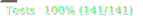

# Game Of Life
    


## Description

The universe of the Game of Life is an infinite two-dimensional grid. Any cell of the grid is in one of two possible states: dead or alive. Every cell interacts with its eight neighbours, which are the cells that are horizontally, vertically, or diagonally adjacent.
The universe evolves with time in steps.

At each step (or tick), the following transitions occur:
- Any live cell with fewer than two live neighbours dies, as if caused by under-population.
- Any live cell with two or three live neighbours should live on to the next generation.
- Any live cell with more than three live neighbours dies, as if by over-population.
- Any dead cell with exactly three live neighbours becomes a live cell, as if by reproduction.

The initial pattern constitutes the **seed** of the system. The first generation is created by **applying the above rules simultaneously to every cell in the seed**.

The rules continue to be applied repeatedly to create further generations.

## My approach of solving the problem

My brain tends to focus on small details first, and when I try to start from the outside in, I get overwhelmed with all the small details I still have to implement. So I wanted to start with the smallest entity of the Game: the `Cell`. But then I realised the `Cell` has to have the state **dead** or **alive** and the third Object Calisthenics rule dictates you have to encapsulate primitives, so I started with an even smaller entity: the `CellState`. 

1. The [CellState](src/cell-state.ts) class can be created using two factory methods: `CellState.dead()` and `CellState.alive()`. This class also has knowledge of how to generate the next state, based on the rules of the game. You just have to pass the number of neighbours to the `nextState()` method. 
2. After that, I created the [Position](src/position.ts) class, which encapsulates the x and y coordinates of a cell. This class also has a method to get the neighbours of a cell. I want to store the position in the cell, because I only want to store the _alive_ cells in the universe.
3. Next comes the [Cell](src/cell.ts) class, with the CellState and the Position. The `Cell` knows how to present itself with a string representation using the `toString()` method.
4. The [Grid](src/grid.ts) class wraps collection of cells. I use a `Map<string, Cell>;` to store the cells. The key of the map is the string representation of the position of the cell. The Game of life should have an _infinite_ two-dimensional grid, but that's hard to show on a screen, so I decided to add a [Bounds](src/bounds.ts) class, which holds the minimum and maximum row/column.
5. To determine the next generation, the grid has use two loops to iterate over all the rows and columns. Because the `Bounds` class has the minimum and maximum row/column, I added a `Generator` object to the `Bounds` class which contains the two loops:

```typescript
*positions(): Generator<Position> {
    for (let row = this.min.row; row <= this.max.row; row++) {
        for (let col = this.min.column; col <= this.max.column; col++) {
            yield new Position(row, col);
        }
    }
}
```

This `Grid` uses this method in this way:

```typescript
for (const position of this.bounds.positions()) {
    const cell = this.computeNextCellState(position);

    if (cell.isAlive()) cells.push(cell);
}
```
6. The next piece of the puzzle is the [GameOfLife](src/game-of-life.ts) class. This class contains the `Grid` and the `tick()` method. The `tick()` method creates a new `Grid` with the next generation of cells. It also contains an instance of a class that implements the `UserInterface` interface, which is used to display the grid.
7. The final piece of the puzzle is the ability to actually run the simulation. The file [app.ts](src/app.ts) creates a GameOfLife object with an initial collection of cells and calls the `tick()` method in a loop.

```typescript
setInterval(() => {
    game.tick();
}, 200);
```


## Running the application

Run the application with this command:

```shell
pnpm start
```

## Unit tests

Run the unit test with this command:

```shell
pnpm test
```

## Coverage of unit tests

You can check the code coverage and view the html results by running this command:

```shell
pnpm test:coverage && open coverage/index.html
```
